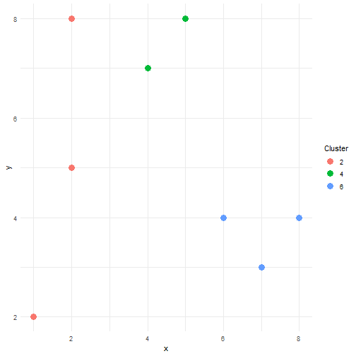

If we consider the points: x1=(2,8), x2=(2,5), x3=(1,2), x4=(5,8), x5=(7,3), x6=(6,4)
x7=(8,4), x8=(4,7)

 and we are asked to **Obtain the euclidean distance matrix**
 How can we solve this problem ?

-  We first build the matrix with the points


```r
x<-c(2,2,1,5,7,6,8,4)
y<-c(8,5,2,8,3,4,4,7)
mydata<-cbind(x,y)
```

To obtain the euclidean distance we use the R function dist with method="euclidean"
and we named that distance element D. 


```r
D<-dist(mydata,method="euclidean")
```

D is a *"dist"* class element. It´s hard to use it directly. So , in the next step we transform it and  create a matrix that we call DD with 8 rows and 8 columns (equal to the total data points that we have). Then we complete the empty matrix with the values of the distance using the reshape function.


```r
library(reshape2)

DD <- melt(as.matrix(D), varnames = c("row", "col"))
D2 <-  matrix(0, nrow=dim(mydata)[1], ncol=dim(mydata)[1])


for (i in DD$row){
  for (j in DD$col){
    D2[i,j]<-DD[which(DD$row==i & DD$col==j ),3]
  }
}
D2
```

```
##          [,1]     [,2]     [,3]     [,4]     [,5]     [,6]     [,7]
## [1,] 0.000000 3.000000 6.082763 3.000000 7.071068 5.656854 7.211103
## [2,] 3.000000 0.000000 3.162278 4.242641 5.385165 4.123106 6.082763
## [3,] 6.082763 3.162278 0.000000 7.211103 6.082763 5.385165 7.280110
## [4,] 3.000000 4.242641 7.211103 0.000000 5.385165 4.123106 5.000000
## [5,] 7.071068 5.385165 6.082763 5.385165 0.000000 1.414214 1.414214
## [6,] 5.656854 4.123106 5.385165 4.123106 1.414214 0.000000 2.000000
## [7,] 7.211103 6.082763 7.280110 5.000000 1.414214 2.000000 0.000000
## [8,] 2.236068 2.828427 5.830952 1.414214 5.000000 3.605551 5.000000
##          [,8]
## [1,] 2.236068
## [2,] 2.828427
## [3,] 5.830952
## [4,] 1.414214
## [5,] 5.000000
## [6,] 3.605551
## [7,] 5.000000
## [8,] 0.000000
```
Our next step, is  **determine 3 clusters if we initialize kmeans method in the centers x2, x4 and x6 after 3 iterations.** 

We begin with the centers x2, x4 and x5, compare each distance and assign the observation to the cluster (2,4 or 6) with minimum distance. (Part one of the code)
We save the result of the classification in a matrix called cluster (each column corresponds to an iteration). 
We repeat this exercise for two additional center combination. (Part two and part three)
We also save the distance of each observation to the cluster assigned in order to, after perform all the iterations decide which one of the classification is the best one. The criteria will be to choose the cluster classification that minimize the mean distance within cluster. We choose the best cluster classification in part 4 of the code. 


```r
 # Part One

centers1t<-c(2,4,6)
cluster<-matrix(0, nrow=nrow(mydata),ncol=3)
dist<-matrix(0, nrow=nrow(mydata),ncol=3)
minfun<-matrix(0, ncol=1, nrow=3)

for (i in 1:nrow(mydata)){
  j=2
   if (D2[j,i]<=D2[j+2,i] & D2[j,i]<=D2[j+4,i]){
     cluster[i,1]<-j
     dist[i,1]<-D2[j,i]
   }else if (D2[j+2,i]<=D2[j,i] & D2[j+2,i]<=D2[j+4,i]){
 cluster[i,1]<-j+2
 dist[i,1]<-D2[j+2,i]
 }else{
     cluster[i,1]<-j+4
      dist[i,1]<-D2[j+4,i]
 }
 }


#part two
centers2it<-c(3,2,1)

for (i in 1:nrow(mydata)){
  j=1
   if (D2[j,i]<=D2[j+2,i] & D2[j,i]<=D2[j+1,i]){
     cluster[i,2]<-j
     dist[i,2]<-D2[j,i]
   }else if (D2[j+2,i]<=D2[j,i] & D2[j+2,i]<=D2[j+1,i]){
 cluster[i,2]<-j+2
 dist[i,2]<-D2[j+2,i]
 }else{
     cluster[i,2]<-j+1
      dist[i,2]<-D2[j+1,i]
 }
 }

#part 3
centers3it<-c(5,7,8)
 
for (i in 1:nrow(mydata)){
  j=5
   if (D2[j,i]<=D2[j+2,i] & D2[j,i]<=D2[j+3,i]){
     cluster[i,3]<-j
     dist[i,3]<-D2[j,i]
   }else if (D2[j+2,i]<=D2[j,i] & D2[j+2,i]<=D2[j+3,i]){
 cluster[i,3]<-j+2
 dist[i,3]<-D2[j+2,i]
 }else{
     cluster[i,3]<-j+3
      dist[i,3]<-D2[j+3,i]
 }
}

#part 4
dist<-as.data.frame(dist)
minfun<-colSums(dist)*(1/8)
winner<-which.min(minfun)
```

We can plot the best classification of this exercise with 3 iterations, that in this case is the first one (centers 2, 4 and 6) stored in the *winner* element:




