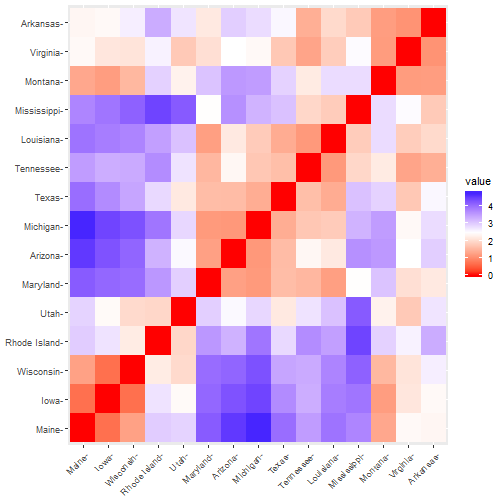

### Kmeans cluster analysis: Example based on the book "Practical Guide To Cluster Analysis in R, Unsupervised Machine Learning", author:Alboukadel Kassambara.


```r
##Libraries
#install.packages("cluster")
#install.packages("factoextra")

library(cluster)
library(factoextra)
```

#### Clustering example 

First we load the data. We are going to use UsArrest data. According to the description ?UsArrests This data set contains statistics, in arrests per 100,000 residents for assault, murder, and rape in each of the 50 US states in 1973. Also given is the percent of the population living in urban areas.
For clustering analysis you have to remove or estimate missing data.
The second step is to scale datais used to determine standarized values for each element in a data set. The scale transformation technique that can be used in clustering analysis takes the mean of the  Variable and divide with the sd. New value=(xi-Xmean)/sd. This operation in performed with the scale function.


```r
#?UsArrests
data("USArrests")
df <- na.omit(df)  # remove missing data
df <- scale(USArrests)
head(df, n = 3) # View the firt 3 rows of the data
```

```
##             Murder   Assault   UrbanPop         Rape
## Alabama 1.24256408 0.7828393 -0.5209066 -0.003416473
## Alaska  0.50786248 1.1068225 -1.2117642  2.484202941
## Arizona 0.07163341 1.4788032  0.9989801  1.042878388
```
#### Distances

The classification of observations into groups requires some methods for computing
the distance or the (dis)similarity between each pair of observations. The result of
this computation is known as a dissimilarity or distance matrix.
There are many methods to calculate the distance. 

We obtain the distance for the first 15 rows to show the results. In this case we use euclidean distance but other methods are available. 


```r
set.seed(123)# Subset of the data
ss <- sample(1:50, 15) # Take 15 random rows
df <- USArrests[ss, ] # Subset the 15 rows
df.scaled <- scale(df) # Standardize the variables

#computing euclidean distance using r base dist function

dist.eucl <- dist(df.scaled, method = "euclidean")

# Reformat as a matrix
# Subset the first 3 columns and rows and Round the values
distance<-round(as.matrix(dist.eucl), 1)

head(distance)
```

```
##              Iowa Rhode Island Maryland Tennessee Utah Arizona Mississippi
## Iowa          0.0          2.8      4.1       3.3  2.4     4.3         3.9
## Rhode Island  2.8          0.0      3.6       3.7  2.0     3.3         4.4
## Maryland      4.1          3.6      0.0       1.5  3.0     1.3         2.4
## Tennessee     3.3          3.7      1.5       0.0  2.8     2.4         2.0
## Utah          2.4          2.0      3.0       2.8  0.0     2.5         4.2
## Arizona       4.3          3.3      1.3       2.4  2.5     0.0         3.6
##              Wisconsin Virginia Maine Texas Louisiana Montana Michigan
## Iowa               0.7      2.1   0.7   3.7       3.9     1.2      4.4
## Rhode Island       2.2      2.6   3.0   2.9       3.5     3.0      3.9
## Maryland           4.0      2.1   4.2   1.6       1.2     3.1      1.2
## Tennessee          3.4      1.3   3.5   1.6       1.2     2.2      1.7
## Utah               2.0      1.8   2.9   2.2       3.1     2.3      2.9
## Arizona            4.1      2.5   4.6   1.6       2.2     3.6      1.2
##              Arkansas
## Iowa              2.4
## Rhode Island      3.3
## Maryland          2.2
## Tennessee         1.4
## Utah              2.7
## Arizona           3.0
```

We can obtain a graph of the distance matrix


```r
library(factoextra)
fviz_dist(dist.eucl)
```



#### Computing kmeans
For computing kmeans we use the kmeans function. First we scale the full data. 
The arguments of the function are
- x is data
- centers= number of clasters (k) or a set of initial cluster centers. If a number, a random set of 
- distinct rows in x is chosen as the inital centers. 
- iter max. maximum number of interation allowed, default is 10
- algorithm = c("Hartigan-Wong", "Lloyd", "Forgy", "MacQueen")


```r
data("USArrests") # Loading the data set
df <- scale(USArrests) # Scaling the data
# View the firt 3 rows of the data
head(df, n = 3)
```

```
##             Murder   Assault   UrbanPop         Rape
## Alabama 1.24256408 0.7828393 -0.5209066 -0.003416473
## Alaska  0.50786248 1.1068225 -1.2117642  2.484202941
## Arizona 0.07163341 1.4788032  0.9989801  1.042878388
```

```r
clusters<-kmeans(df,2)
clusters_type<-clusters$cluster
```

The element  that we named clusters, resulting from the kmeans algorithm contains a lot of results. The most important are clusters tags for each observation, and the centers. 
We can print the results or obtain elements 


```r
#print(clusters)

# Cluster number for each of the observations
clusters$cluster
```

```
##        Alabama         Alaska        Arizona       Arkansas     California 
##              2              2              2              1              2 
##       Colorado    Connecticut       Delaware        Florida        Georgia 
##              2              1              1              2              2 
##         Hawaii          Idaho       Illinois        Indiana           Iowa 
##              1              1              2              1              1 
##         Kansas       Kentucky      Louisiana          Maine       Maryland 
##              1              1              2              1              2 
##  Massachusetts       Michigan      Minnesota    Mississippi       Missouri 
##              1              2              1              2              2 
##        Montana       Nebraska         Nevada  New Hampshire     New Jersey 
##              1              1              2              1              1 
##     New Mexico       New York North Carolina   North Dakota           Ohio 
##              2              2              2              1              1 
##       Oklahoma         Oregon   Pennsylvania   Rhode Island South Carolina 
##              1              1              1              1              2 
##   South Dakota      Tennessee          Texas           Utah        Vermont 
##              1              2              2              1              1 
##       Virginia     Washington  West Virginia      Wisconsin        Wyoming 
##              1              1              1              1              1
```

```r
# Cluster size
clusters$size
```

```
## [1] 30 20
```

```r
# Cluster means
clusters$centers
```

```
##      Murder    Assault   UrbanPop       Rape
## 1 -0.669956 -0.6758849 -0.1317235 -0.5646433
## 2  1.004934  1.0138274  0.1975853  0.8469650
```

We can compute the mean of each clustering using the original data and add the point classification to the original data. 


```r
## compute the mean of each cluster using original data

aggregate(USArrests, by=list(cluster=clusters$cluster), mean)
```

```
##   cluster Murder  Assault UrbanPop     Rape
## 1       1  4.870 114.4333 63.63333 15.94333
## 2       2 12.165 255.2500 68.40000 29.16500
```

```r
## add the point classification to the original data

dd <- cbind(USArrests, cluster = clusters$cluster)
```

We can also plot the results of the classification. 


#### cluster plot


```r
fviz_cluster(clusters, data = df,
             palette = c("red", "blue"),
             ellipse.type = "euclid", # Concentration ellipse
             star.plot = TRUE, # Add segments from centroids to items
             repel = TRUE, # Avoid label overplotting (slow)
             ggtheme = theme_minimal()
)
```


#### Deciding the number of clusters 
In the first part we decide de number of cluster. We may be interest to find a method to decide the best number of clusters. 


```r
library(factoextra)
fviz_nbclust(df, kmeans, method = "wss") +
  geom_vline(xintercept = 4, linetype = 2)
```


According to this graphic the number of clusters in this situation is 4. 


```r
# Compute k-means with k = 4
set.seed(123)
km.res <- kmeans(df, 4, nstart = 25)
# Print the results
print(km.res)
```

```
## K-means clustering with 4 clusters of sizes 13, 16, 13, 8
## 
## Cluster means:
##       Murder    Assault   UrbanPop        Rape
## 1 -0.9615407 -1.1066010 -0.9301069 -0.96676331
## 2 -0.4894375 -0.3826001  0.5758298 -0.26165379
## 3  0.6950701  1.0394414  0.7226370  1.27693964
## 4  1.4118898  0.8743346 -0.8145211  0.01927104
## 
## Clustering vector:
##        Alabama         Alaska        Arizona       Arkansas     California 
##              4              3              3              4              3 
##       Colorado    Connecticut       Delaware        Florida        Georgia 
##              3              2              2              3              4 
##         Hawaii          Idaho       Illinois        Indiana           Iowa 
##              2              1              3              2              1 
##         Kansas       Kentucky      Louisiana          Maine       Maryland 
##              2              1              4              1              3 
##  Massachusetts       Michigan      Minnesota    Mississippi       Missouri 
##              2              3              1              4              3 
##        Montana       Nebraska         Nevada  New Hampshire     New Jersey 
##              1              1              3              1              2 
##     New Mexico       New York North Carolina   North Dakota           Ohio 
##              3              3              4              1              2 
##       Oklahoma         Oregon   Pennsylvania   Rhode Island South Carolina 
##              2              2              2              2              4 
##   South Dakota      Tennessee          Texas           Utah        Vermont 
##              1              4              3              2              1 
##       Virginia     Washington  West Virginia      Wisconsin        Wyoming 
##              2              2              1              1              2 
## 
## Within cluster sum of squares by cluster:
## [1] 11.952463 16.212213 19.922437  8.316061
##  (between_SS / total_SS =  71.2 %)
## 
## Available components:
## 
## [1] "cluster"      "centers"      "totss"        "withinss"    
## [5] "tot.withinss" "betweenss"    "size"         "iter"        
## [9] "ifault"
```

```r
## compute the mean of each cluster using original data

aggregate(USArrests, by=list(cluster=km.res$cluster), mean)
```

```
##   cluster   Murder   Assault UrbanPop     Rape
## 1       1  3.60000  78.53846 52.07692 12.17692
## 2       2  5.65625 138.87500 73.87500 18.78125
## 3       3 10.81538 257.38462 76.00000 33.19231
## 4       4 13.93750 243.62500 53.75000 21.41250
```

```r
## add the point clasificattion to the original data

dd <- cbind(USArrests, cluster = km.res$cluster)


## resutls of cluster

# Cluster number for each of the observations
km.res$cluster
```

```
##        Alabama         Alaska        Arizona       Arkansas     California 
##              4              3              3              4              3 
##       Colorado    Connecticut       Delaware        Florida        Georgia 
##              3              2              2              3              4 
##         Hawaii          Idaho       Illinois        Indiana           Iowa 
##              2              1              3              2              1 
##         Kansas       Kentucky      Louisiana          Maine       Maryland 
##              2              1              4              1              3 
##  Massachusetts       Michigan      Minnesota    Mississippi       Missouri 
##              2              3              1              4              3 
##        Montana       Nebraska         Nevada  New Hampshire     New Jersey 
##              1              1              3              1              2 
##     New Mexico       New York North Carolina   North Dakota           Ohio 
##              3              3              4              1              2 
##       Oklahoma         Oregon   Pennsylvania   Rhode Island South Carolina 
##              2              2              2              2              4 
##   South Dakota      Tennessee          Texas           Utah        Vermont 
##              1              4              3              2              1 
##       Virginia     Washington  West Virginia      Wisconsin        Wyoming 
##              2              2              1              1              2
```

```r
# Cluster size
km.res$size
```

```
## [1] 13 16 13  8
```

```r
# Cluster means
km.res$centers
```

```
##       Murder    Assault   UrbanPop        Rape
## 1 -0.9615407 -1.1066010 -0.9301069 -0.96676331
## 2 -0.4894375 -0.3826001  0.5758298 -0.26165379
## 3  0.6950701  1.0394414  0.7226370  1.27693964
## 4  1.4118898  0.8743346 -0.8145211  0.01927104
```

```r
#cluster plot

fviz_cluster(km.res, data = df,
             palette = c("#2E9FDF", "#00FFBB", "#E7B800", "#FC4E07"),
             ellipse.type = "euclid", # Concentration ellipse
             star.plot = TRUE, # Add segments from centroids to items
             repel = TRUE, # Avoid label overplotting (slow)
             ggtheme = theme_minimal()
)
```


We plot the map with the result of classification 


```r
library(usmap)
library(ggplot2)

dfplot<-statepop
dfplot<-dfplot[,-4]

dd$state<-rownames(dd)
library(ggplot2)
library(dplyr)
```

```
## 
## Attaching package: 'dplyr'
```

```
## The following objects are masked from 'package:stats':
## 
##     filter, lag
```

```
## The following objects are masked from 'package:base':
## 
##     intersect, setdiff, setequal, union
```

```r
statesMap <- map_data("state")
```

```
## 
## Attaching package: 'maps'
```

```
## The following object is masked from 'package:cluster':
## 
##     votes.repub
```

```r
dd$region <- tolower(dd$state)
crimeMap <- merge(statesMap, dd, by = "region")
str(crimeMap)
```

```
## 'data.frame':	15527 obs. of  12 variables:
##  $ region   : chr  "alabama" "alabama" "alabama" "alabama" ...
##  $ long     : num  -87.5 -87.5 -88 -88 -88 ...
##  $ lat      : num  30.4 30.4 30.2 30.2 30.3 ...
##  $ group    : num  1 1 1 1 1 1 1 1 1 1 ...
##  $ order    : int  1 2 13 14 15 3 4 5 6 7 ...
##  $ subregion: chr  NA NA NA NA ...
##  $ Murder   : num  13.2 13.2 13.2 13.2 13.2 13.2 13.2 13.2 13.2 13.2 ...
##  $ Assault  : int  236 236 236 236 236 236 236 236 236 236 ...
##  $ UrbanPop : int  58 58 58 58 58 58 58 58 58 58 ...
##  $ Rape     : num  21.2 21.2 21.2 21.2 21.2 21.2 21.2 21.2 21.2 21.2 ...
##  $ cluster  : int  4 4 4 4 4 4 4 4 4 4 ...
##  $ state    : chr  "Alabama" "Alabama" "Alabama" "Alabama" ...
```

```r
map<-ggplot(crimeMap, aes(x = long, y = lat))+geom_polygon(aes( group = group, fill=cluster)) 
map<-map+ labs(title="Clusters of crime", subtitle="Uscrime data", y="", x="")+theme_minimal()+ theme(axis.text.x=element_blank())+ theme(axis.text.y=element_blank())
map
```


